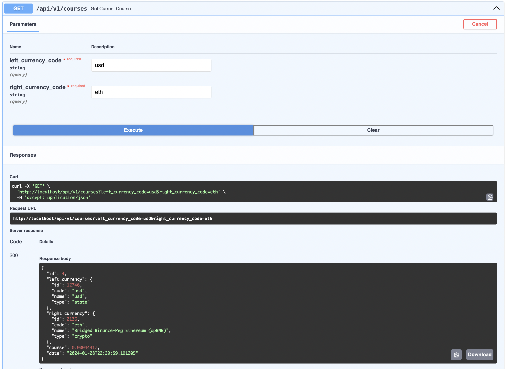

Данный проект является моей попыткой реализовать принципы чистой архитектуры.
В ходе работы над проектом я в большей степени концентрировался именно на построении архитектуры, на связях между слоями, поэтому проект лишен проработанной бизнес-логики, проверок типов.

Приложение разбито на 4 слоя: 

- Domain - уровень логики домена
- Application - уровень логики связи между слоями домена и адаптерами/контроллерами
- Adapters - слой адаптеров к БД и API бирж
- Controllers - слой для контроллеров (FastAPI)

Для репозитория описан docker-compose файл, запускающий контейнер с приложением, контейнер с Postgres и контейнер с Nginx в качестве API Gateway, стоящего на входе.

Проект запускается командой <b>docker-compose up</b>.

Доступна OpenAPI спецификация по адресу http://localhost/api/v1/docs

